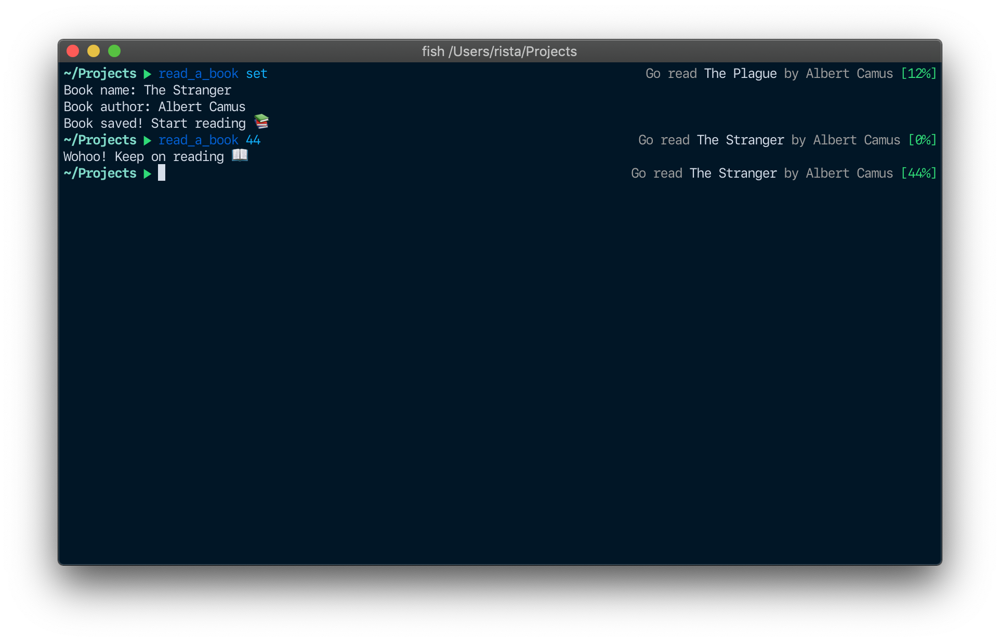

# Read A Book CLI

Small CLI app I created to remind me to read (hope it's gonna work). Use `read_a_book set` to set the book and `read_a_book [0-100]` to set the percentage. Pretty simple.

It will only show the message before 10 in the morning or after 19 in the evening. I recommend displaying it in the prompt like so:



### Right prompt in fish shell

```sh
function fish_right_prompt
  read_a_book
end
```

### Building from source

You must have go `1.12` installed.

`make build` + `make set_global`